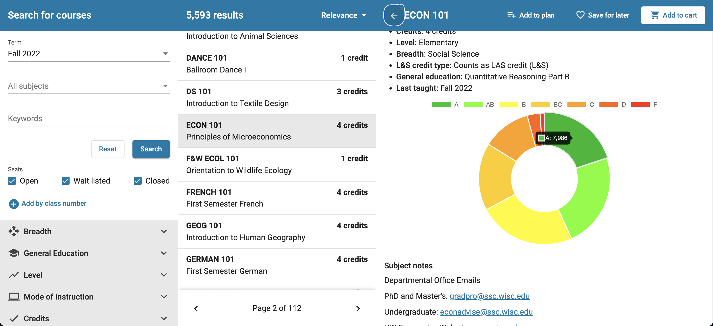

# MadEnroll
Chrome extension that displays GPA data on the UW-Madison course enrollment website using a grade distribution database.

**Contributors**
- [Arthur Wang](https://www.github.com/tzanccc)
- [Max Drexler](https://www.github.com/mndrexler)
